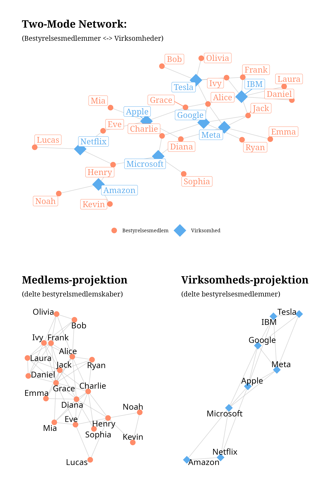
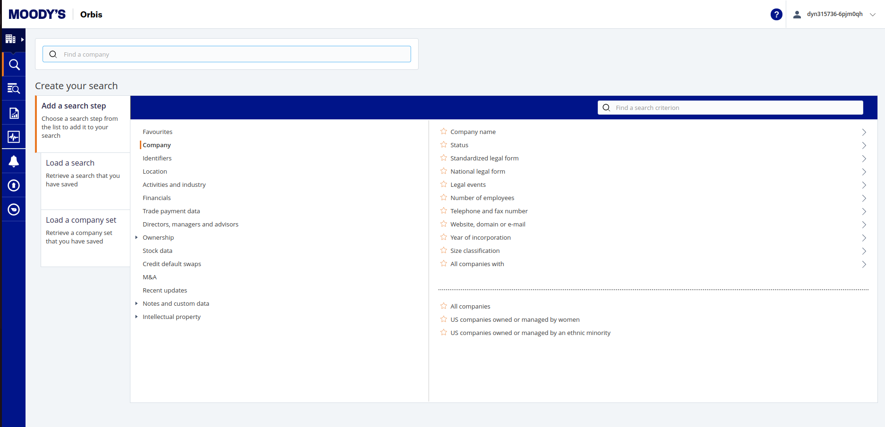
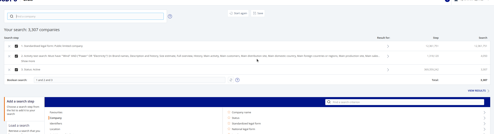
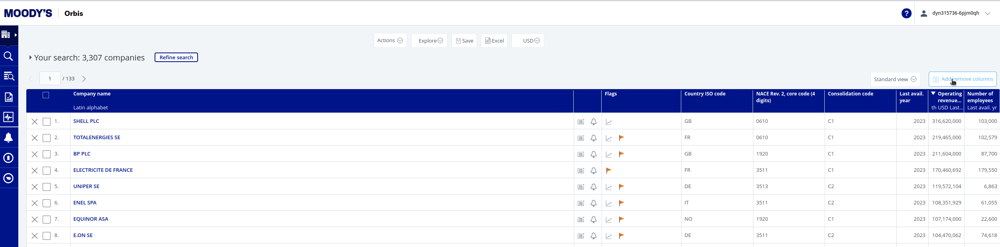
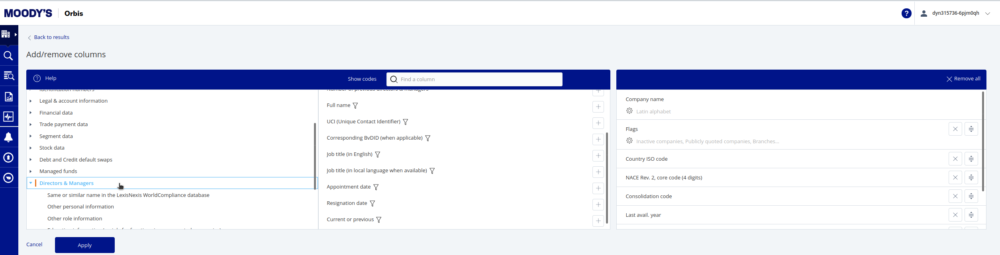
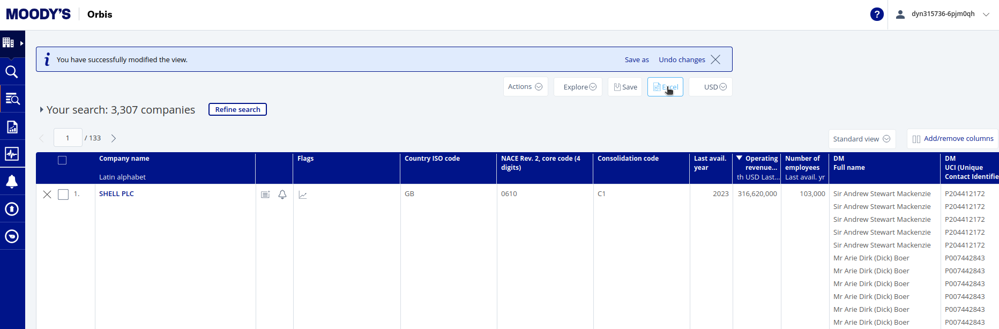
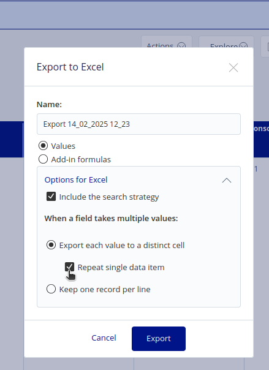
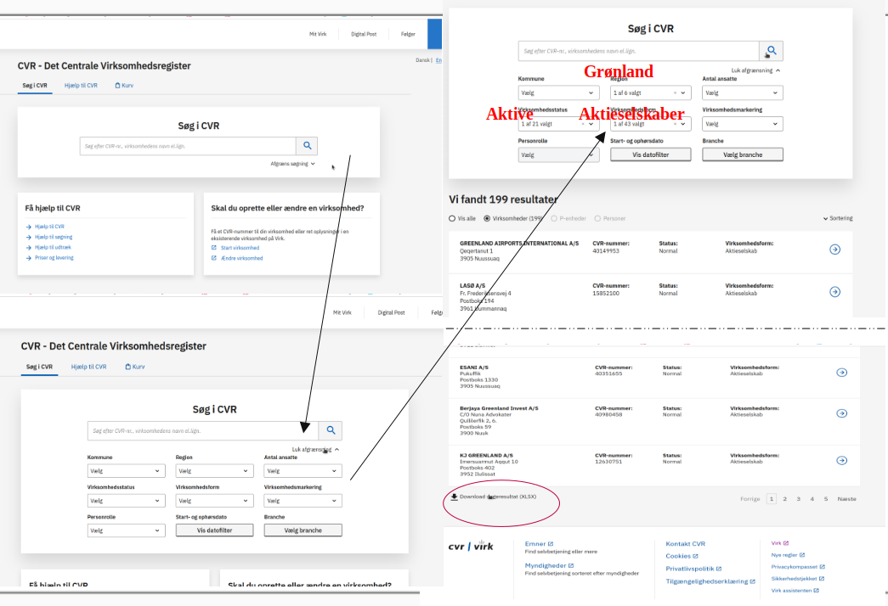
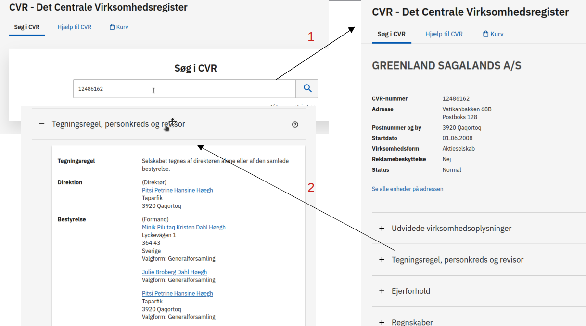
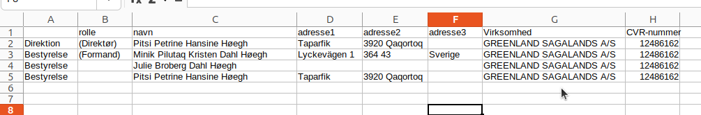

```{r, echo = F, message=F}
# Load necessary packages
library(igraph)
library(ggraph)
library(patchwork)
# Define nodes
directors <- c("Alice", "Bob", "Charlie", "Diana", "Eve", "Frank", "Grace", 
               "Henry", "Ivy", "Jack", "Kevin", "Laura", "Olivia", "Ryan", 
               "Sophia", "Noah", "Mia", "Lucas", "Emma", "Daniel")

companies <- c("Tesla", "Google", "Microsoft", "Amazon", "Apple", "Netflix", "Meta", "IBM")

# Define edges (director-company board memberships)
edges <- c(
  # Directors serving multiple companies
  "Alice", "Tesla",
  "Alice", "Google",
  "Alice", "Meta",
  "Bob", "Tesla",
  "Charlie", "Google",
  "Charlie", "Microsoft",
  "Charlie", "Apple",
  "Diana", "Microsoft",
  "Diana", "Apple",
  "Diana", "Meta",
  "Eve", "Apple",
  "Eve", "Netflix",
  "Frank", "Tesla",
  "Frank", "IBM",
  "Grace", "Apple",
  "Grace", "Google",
  "Grace", "IBM",
  "Henry", "Amazon",
  "Henry", "Microsoft",
  "Henry", "Netflix",
  "Ivy", "Tesla",
  "Ivy", "IBM",
  "Jack", "Google",
  "Jack", "Meta",
  "Jack", "IBM",
  "Kevin", "Amazon",  # Previously added unique director
  "Laura", "IBM",     # Previously added unique director
  
  # NEW: Unique directors for each company
  "Olivia", "Tesla",
  "Ryan", "Google",
  "Sophia", "Microsoft",
  "Noah", "Amazon",
  "Mia", "Apple",
  "Lucas", "Netflix",
  "Emma", "Meta",
  "Daniel", "IBM"
)
# Create a bipartite graph
g <- make_graph(edges, directed = FALSE)

# Assign node types: 0 for students, 1 for clubs
V(g)$type <- V(g)$name %in% companies

p1 <- ggraph(g, "kk") +
  geom_edge_link(aes(edge_alpha = 0.8), color = "gray") +
  geom_node_point(aes(color = type, shape = type, size = type)) +
  geom_node_label(aes(label = name, color = type), repel = TRUE, show.legend = FALSE,size = 5, family = "serif") +
  scale_color_manual(values = c("salmon1", "steelblue2"), labels = c("Bestyrelsesmedlem", "Virksomhed"), name = "") +
  scale_shape_manual(values = c(20, 18), labels = c("Bestyrelsesmedlem", "Virksomhed"), name = "") +
  scale_size_manual(values = c(6, 10), labels = c("Bestyrelsesmedlem", "Virksomhed"), name = "") +
  theme_graph(base_family = "serif") + guides(edge_alpha = "none", color = guide_legend(position = "bottom")) +
  ggtitle( "Two-Mode Network:", subtitle = "(Bestyrelsesmedlemmer <-> Virksomheder)") + theme(title = element_text(size = 8))

# Create Student Projection (One-Mode)
student_proj <- bipartite_projection(g)$proj1

# Plot the student projection
p2 <- ggraph(student_proj, "kk") +
  geom_edge_link(aes(edge_alpha = 0.8), color = "gray") +
  geom_node_point(color = "salmon1", size = 6, shape = 20) +
  geom_node_text(aes(label = name), repel = TRUE, size = 5) +
  theme_graph(base_family = "serif") + guides(edge_alpha = "none") +
  ggtitle("Medlems-projektion", subtitle = "(delte bestyrelsmedlemskaber)") + theme(title = element_text(size = 8))

# Create Club Projection (One-Mode)
club_proj <- bipartite_projection(g)$proj2

# Plot the club projection
p3 <- ggraph(club_proj, layout = "fr") +
  geom_edge_link(aes(edge_alpha = 0.8), color = "gray") +
  geom_node_point(color ="steelblue2", size = 6, shape =18) +
  geom_node_text(aes(label = name), repel = TRUE, size = 5) +
  theme_graph(base_family = "serif") + guides(edge_alpha = "none") +
  ggtitle("Virksomheds-projektion", subtitle = "(delte bestyrelsesmedlemmer)") + theme(title = element_text(size = 8))

p <- (p1 / (p2 | p3)) 
ggsave(filename = "images/session2.png", plot = p, width = 20, height = 30, units = c("cm"))

```

# Vigtige spørgsmål ift netværksdata

::: callout-note
Som med al anden indsamling af samfundsvidenskabelig data er det også med netværksanalyse meget vigtig at man forholder sig til en række metodologiske og videnskabsteoretiske spørgsmål, allerede i den fase, hvor man overvejer hvilken data man vil indsamle(/bruge) og hvordan man vil indsamle(/bruge) det!
:::

I social netværksanalyse behandler vi data *relationelt*, dvs. vi har nogle enheder (mennesker, virksomheder, 'ideer/begreber', hjemmesider), som vi antager indgår i nogle relationer, som vi gerne vil strudere på en systematisk måde. Det betyder at vi på et visuelt plan hele tiden arbejder med punkter (vertices eller noder) der er forbundet (eller ikke forbundet) af streger (edges):

::::: grid
::: g-col-6
{width="50%"}
:::

::: g-col-6
{width="50%"}
:::
:::::

Det rejser nogle vigtige spørgsmål:

1.  Hvad er en relation?

    -   Er det medlemskaber (som i figuren til højre, de to blå punkter er begge medlem af det røde punkt), er det venskaber/kendskaber (som i figuren til venstre de tre blå punkter kender hinanden). Er relationen samtidig? dvs. Er de to blå punkter fx. medlem af den samme klub nu(!) eller er det nok (for vores analyse) at de begge har været med på et tidspunkt, men ikke nødvendigvis samtidig? En forbindelse kan også udtrykke udveklingsrelationer. Er det fx to virksomheder der sender penge eller varer til hinanden? Eller kampagnedonationer til politikere/partier? Relationer kan også være mere abstrakte, fx. relationer mellem ideer og begreber, fx semantiske relationer eller referencer - "forfatter B" trækker på "forfatter A"s ideer osv. På mange måder mulighederne uendelige. Det vigtigste er at man er eksplicit og tydelig omkring hvad man mener man kigger på. Det har nemlig stor betydning for om man faktisk viser det man tror man viser i sine analyser. Det er også afgørende om tænker at relationen har en **retning**, som i eksemlet med forfatter B, der trækker på forfatter As ideer. Der kan man sige at relationen fra B til A (eller den anden vej for den sags skyld; er det det at B *trækker* på A, der er afgørende eller er det det at ideen *flyder* fra A til B der er afgørende?). Eller er relationen gensidig, når A og B er vener. Har relationerne forskellig **vægt**? Kender A og B fx hinanden *mere* eller *bedre* end B kender C osv.?

2.  Hvad er et punkt?

    -   I skal også forholde jer til hvad enheden i analyserne er? Hvad er udgør et punkt? Og hvilke punkter skal med? Hvis vi kiggede på venskaber i en klasse, så er punkterne måske klassens elever. Men hvad hvis elev A og B ikke nævner hinanden som venner, men begge nævner X fra parallelklassen? Skal X så med? Skal hele parallelklassen med? Eller hele skolen? Og måske også naboskolen? Det er et helt afgørende spørgsmål i netværksanalyse: Hvor starter og slutter netværket?

3.  Hvilken slags netværk er det vi kigger på?

    -   Som vi tidligere har talt om kan vi have både netværk mellem en enkelt type af aktører og netværk mellem flere typer af 'aktører'. Ofte har vi måske indsamlet et netværk med to distinkte typer (et bipartite netværk), fx bestyrelsespersoner og deres virksomheder, eller forfattere og deres begreber osv. I en analytisk sammenhæng kunne vi måske være interesseret i at rette blikket mod (de formidlede) relationer mellem én netværkets enheder. Det kræver en så kaldt projektion af netværket.



En vigtig del af en netværksanalyse er at forholde sig til spørgsmål som disse. Hvilken mekanisme er vi interesseret i at studere. Er vi optaget af en epidemologisk kortlægning af risikoen for spredning af coronavirus? Ja men, så vi nødt til at tænke relationen som en eller anden grad af fysisk kontakt. Er vi interesseret i indflydelse på beslutninger, så er relationen måske medlemskab i organer, hvor der træffes beslutninger. Er vi interesseret i popularitet og anerkendelse, så er relationen vi skal lede efter måske oplevede venskaber. Vil vi studere muligheder for innovation i virksomheder, så skal vi måske forstå relationerne som et flow af vidensdeling mellem individer eller teams.

Selvom netværksanalyse på papiret 'bare' er punkter og streger er det altså utrolig vigtigt at forholde sig til hvad punkterne og stregerne repræsenterer.

# Kilder til Netværksdata:

Lod os kigge nærmere på hvilke typer af data I kan bruge i jeres eksamensopgaver. Der er grundlæggende tre muligheder:

-   I kan bruge Danish Elite Network 2024 (Ellersgaard og Larsen m.fl), og finde et spændende subset af dette, I kan analysere
-   I kan bruge CBS' adgang til Orbis og definere og downloade et datasæt herfra.
-   I kan bruge andre tilgængelige kilder eller indsamle jeres egen data (the sky is the limit!).

I det følgende skal vi se nærmere på de forskellige mulighedre:

men først indlæser vi lige de R-pakker vi får brug for (som altså skal installeres først, hvis de ikke allerede er det).

```{r, echo = T, message=F}
# install.packages("tidyverse")
# install.packages("igraph")
# install.packages("ggraph")
# install.packages("ggpubr")
# install.packages("readxl")
# install.packages("writexl")
# install.packages("RColorBrewer")

library(tidyverse)
library(tidygraph)
library(igraph)
library(ggraph)
library(ggpubr)
library(readxl)
library(Matrix)
library(RColorBrewer)
```


## Danish Elite Network 2024 (den24)

I mappen `"/data"` i R projketet finder i filen `danish_elitenetworks2024.csv`. Den kan også downloades her, hvis I ikke allerede har den:

[Download den24](data/danish_elitenetworks2024.csv){.btn .btn-primary}

Indlæs data med `read_csv`

```{r, warning=FALSE, message=FALSE}
den <- read_csv("data/danish_elitenetworks2024.csv")
```

den24 er et *affiliation* datasæt, som indeholder bestyrelsesposter og og andre medlemskaber i (stort set) alle (relevante) virksomheder, organisationer, fonde, insitutioner, råd, nævn, kommissioner osv. Dvs alt lige fra Kattens Vaern over A.P. Moeller - Maersk og Novo Nordisk til regeringens sikkerhedsudvalg osv. Hver række i datasættet repræsenterer en position, dvs. en person med en rolle i organisation:

```{r}
den %>% head()
```

Vi kan bruge `glimpse()` til lige at se hvad data ellers indeholder:

```{r}
den %>% glimpse()
```

'Organisationerne' i datasættet er indelt i branchekoder `affiliation_branchekode`(fra cvr) som findes på forskellige aggregerings niveauer (`affiliation_branche_niveau1-5`) og desuden i række `tags` som kategoriserer organisationerne i forskellige emner og underemner. Der er desuden en variabel `affiliation_sektor` som inddeler data fra cvr i forskellige området, fx. virksomheder, kultur osv. 

Lad os lige se hvor mange unikke virksomheder, der findes under hver branche og hver tag. Det gør vi ved at bruge `distinct(affiliation, .keep_all = TRUE)` som gør at den kun tager én række pr virksomhed, men (pga. .keep_all = TRUE) beholder de resterende variable i data.

```{r}
den %>% distinct(affiliation, .keep_all = T) %>% count(affiliation_sektor, sort = T)
den %>% distinct(affiliation, .keep_all = T) %>% count(affiliation_branche_niveau1, sort = T)
den %>% distinct(affiliation, .keep_all = T) %>% count(affiliation_branche_niveau2, sort = T)
den %>% distinct(affiliation, .keep_all = T) %>% count(affiliation_branche_niveau3, sort = T)
den %>% distinct(affiliation, .keep_all = T) %>% count(affiliation_branche_niveau4, sort = T)
den %>% distinct(affiliation, .keep_all = T) %>% count(affiliation_branche_niveau5, sort = T)
den %>% distinct(affiliation, .keep_all = T) %>% count(affiliation_tags, sort = T)
```

Disse branchekoder og emne-tags kan bruges til at udvælge subset af data til forskellige analyser. Det vender vi tilbage til løbende.


## Orbis

En anden kilde til (netværks-)data om virksomheder er *Orbis*. Orbis er en database der indeholder information om virksomheder fra hele verden - omkring 400.000.000 selskaber. Databasen trækker data fra mere end 170 forskellige kilder som standardiseres og linkes på en måde der muliggør sammenlinging. På virksomhedsniveau indeholder orbis blandt meget andet geografisk data, juridisk data, finansiel data, ejerskabsdata mv. om den enkelte virksomhed. Fra et netværksperspektiv er databasen interessant fordi den desuden indeholder (aktuel og historisk) data om virksomhedernes bestyrelse og direktion (m.v.). I det følgende skal vi se hvordan man trækker et bestyrelses-(netværks-)datasæt fra orbis.

::: callout-note
Som med al anden data (særligt data man ikke selv har frembragt), skal man med Orbis være opmærksom på en række

Skim evt. [denne](https://www.oecd.org/content/dam/oecd/en/publications/reports/2020/05/coverage-and-representativeness-of-orbis-data_9628c322/c7bdaa03-en.pdf) rapport fra OECD om Orbis' dækningsgrad. Eller tag et kig på [(Heemskerk et al. 2018)](https://doi.org/10.1111/glob.12183) om bl.a. 'completeness' og problemer med 'entity resolution' - optræder det samme firma eller den samme person flere gange med forskllige versioner af det navn. Det er ikke problemer I behøver at løse, men noget det er værd at bemærke, når man præsenterer den data man analyserer!
:::

Orbis kan tilgås via jeres login til CBS's bibliotek: [**Orbis via cbs**](https://www.cbs.dk/bibliotek/soeg-i-biblioteket/online-ressourcer/orbis)

### At 'bygge' et søgefilter på Orbis

Det første man skal tænke over er hvilke filtre, der er nødvendige for at hente det subset af virksomheder man er interesseret i. Der er selvfølgelig et hav af muligheder.

{fig-align="center" width="600" fig.pos="H"}

1.  Under *Company*, kan man under fx vælge *Standardized legal forms* vælge kun 'Private limited companies' eller også 'Public limited companies'. Man kan også under *Number of employees* vælge kun at kigge på virksomheder af en hvis størrelse.
2.  Under *Location* kan man sætte forskellige geografiske filtre, både lande, regioner m.v., men også forskellige klassifikationer.
3.  Under *Activities and industry* kan man under *Industri classifications* vælge mellem forskellige branche-klassifikationer og herunder udvælge en (eller flere) bestemt(e) branche(r). Man kan desuden under *Entity type* afgrænse virksomhedstype yderligere. En anden mulighed er at man definerer 'fritekst' søgning under *Activity text search*, hvor man under 'scope' vælger hvilke datafelter, der skal søges i og under 'Free text' skriver hvad der skal søges efter. 

Når man har 'bygget' sit filter kan man se hvad de forskellige filtre gør og hvad de til sammen giver af resultat. Næste skridt er *View results* 

### Tilføj bestyrelsesoplysninger til vores data

Her kan vi se alle de virksomheder, der lever op til vores søgekriterier. Det vi gerne vil nu er at tilføje bestyrelsesdata. Klik på *Add/remove columns* øverst til højre.  Scroller man lidt ned i venstre kolonne og klikker på feltet *Directors and managers*, får man i den midsterste kolonne en række valgmuligheder:  Vælg som minimum 1) Full name, 2) UCI, 3) Job title, 4) Current or previous.

Under *Other personal information* og *Other role information* i venstre kolonne kan man tilføje yderligere information om personen og dennes rolle. På personniveau fx. køn og nationalitet mv. På rolleniveau kan det være nyttigt at tilføje 'Type of role' og 'Board, committee or department' og evt. 'Level of responsibility', da det kan give mulighed for at fokusere kun på bestyrelse og direktion.

Hvis man klikker på det lille filter-ikon under fx 'Full name' i den venstre kolonne får man mulighed for at filtrere på rollerne. Det kan være nyttigt her at forholde sig til om man både vil have nuværende og tidligere roller med. Har man tilføjet variablen *Current or previous*, kan man altid filtrere senere, men hvis man ikke gør det her skal man være opmærksom på at data kommer til at indeholde mange rækker (!)

Det er også muligt at tilføje yderligere virksomhedsdata.

Når de variable man gerne vil have med er valg, trykker man *Apply* og så er vi klar til at eksportere data.

### Eksporter data til xlsx

Klik på "Excel".. I den eksport-menu, der kommer op er det vigtigt, at man under *Options for excel* vælger 'Repeat single item data' inden man trykker Export.

::::: grid
::: g-col-6
{width="100%"}
:::

::: g-col-6
{width="80%"}
:::
:::::

Når Orbis har klargjort data, kan man downloade filen til sin computer.

### Eksempel med alkohol og tobak fra Orbis

Jeg har tidligere downloadet et datasæt med alle aktive, public limited companies med branchekoderne Alkohol og tobak ('Manufacture of beverages' NACE#11(-soft drinks 11.0.7) & 'Manufacture of tobacco products' NACE#12)

I kan downloade datasættet her: [Download Data](data/tobaco_and_alcohol.xlsx){.btn .btn-primary} og lægge filen i data mappen i vores Rprojekt mappe. Filen kan også hentes på Canvas.

I kan downloade og indlæse et *script*, der indeholder en funktion skrevet specifikt til dette kursus. Det drejer sig om filen *read_orbis.R*. I kan downloade den her [Download file](functions/read_orbis.R){.btn .btn-primary} og lægge den i Rprojekt mappen. Filen kan også hentes på Canvas. Når filen ligger i mappen kan vi "source" den og anvende funktionen `read_orbisxlsx()`, som er en genvej til at indlæse datafiler fra Orbis. 

::: callout-note
Et script indlæses med funktionen `source(, ...echo = FALSE)`, hvor `echo = FALSE` betyder at scriptet indlæses uden at vise indholdet.
:::

```{r, }
source("functions/read_orbis.R", echo = FALSE)
```

Nu kan vi indlæse orbis-filen `tobaco_and_alcohol.xlsx` ved at indsætten stien til filen (`data/tobaco_and_alcohol.xlsx`) i `read_orbisxlsx()`:

```{r, echo = TRUE}
df <- read_orbisxlsx(path = "data/tobaco_and_alcohol.xlsx")
```

read_orbisxlsx funktionen oversætter bl.a. variabelnavne fra orbis til noget mere meningsfuld og læseligt. Vigtigt: `Current or previous` variablen hedder nu `role_status`. Der er også en ny variabel, `person`, som ud fra identifikationsnummeret 'gætter' om personen faktisk er en person og en variabel, `role_level_rec`, som er en omkodning af `role_level`.

Lad os til at begynde med reducere vores data (`filter()`) til kun aktive/current poster og poster der faktisk er personer:

```{r}
df_current <- df %>% 
  filter(person == TRUE & role_status == "Current")
```

En udfordring ved bestyrelsesdata fra Orbis er at det er uklart/varierende hvor mange individer, der er registreret for hver virksomhed:

```{r}
df_current %>% 
  distinct(name, affiliation) %>% 
  group_by(affiliation) %>% 
  summarise(n = n_distinct(name)) %>% 
  summary(n) 

```

Gennemsnittet har 4 'directors', der er en del en mandsbestyrelser og én virksomhed har `1140` (!) 'directors'. Det skyldes at alle mulige lavere direktører er registreret. Vi kan prøve at løse noget af det med variablen `role_level_rec`, som `read_orbisxlsx` funktione har lavet. Den prøfer indfange meningen af en rolle fra `role_level`-variablen (som i Orbis hed `DMLevel of responsibility`) og fra `role_type` (som i Orbis hed `DMType of role`)

```{r}
df_current %>% count(role_level, sort = T)
df_current %>% count(role_type, sort = T)
df_current %>% count(role_level_rec, sort = T)
```

Nu kan vi så subsette data, så vi kun har de 'niveauer' vi skal bruge. Dvs. alt undtagen 'other'

```{r}
df_current <- df_current %>% 
  filter(role_level_rec %in% c("member","chairman", "vice chairman","executive"))
```

Hvor meget hjalp det? Lad os lige se hvor mange medlemmer de forskellige affilations nu har:
```{r}
df_current %>% 
  distinct(name, affiliation) %>% 
  group_by(affiliation) %>% 
  summarise(n = n_distinct(name)) %>% 
  summary(n) 

```

Der er stadig et meget højt max på `834`.

Vi kan starte med lige at se på hvor mange 'board members' hver virksomhed har: Som I kan se er der nogle meget store 'boards'. Det er et af problemerne med Orbis, nemlig at det er uklart hvad der er registreret per virksomhed.

```{r}
df_current %>% distinct(name, affiliation) %>% count(affiliation, sort = TRUE)
```

Vi kan lave en ny variabel i vores datasæt, der for hvert individ tæller hvor mange virksomeder, de er knyttet til (altså hvor mange medlemskaber:

```{r}
df_current <- df_current %>% group_by(name) %>% mutate(n_memberships = n_distinct(affiliation)) %>% ungroup()
df_current %>% ungroup() %>%  count(n_memberships)
```

Lad os slette personer, `n = 24333`, der 'kun' sidder i en enkelt virksomhed, da de alligevel ikke laver nogen forbindelser på tværs af virksomheder i vores netværk. Vi sletter så at sige folk i vores affiliation data, der ikke er 'linkere' (`filter()`) og samtidig sørger vi for at hvert individ kun optræder én gang per virksomhed (`distinct()`) - det kan jo være at nogen har mere end en rolle i samme bestyrelse (datasnavs?).

```{r}
df_current <- df_current %>% 
  filter(n_memberships > 1) %>% 
  distinct(name, affiliation, .keep_all = TRUE)
```

Hvor meget hjalp det så?
```{r}
df_current %>% distinct(name, affiliation) %>% count(affiliation, sort = TRUE)

```
Nu har den største bestyrelse 41 medlemmer. Meget bedre!

##### Fra data til netværk.

Husk fra sidst [Session 1 (uge 6): Introduktion til netværksanalyse i R](session1.html), hvordan vi kommer fra et affiliation datasæt som vi har her, med rækker der forbinder "individer" til "organisationer". Her er et skematisk overblik.

 R-kode til at lave 'biadjacency matricen' med individer i rækker og affiliations i kolonner (husk sparse!)

```{r}
bi_adj <- xtabs(data = df_current, formula = ~name + affiliation, sparse = TRUE)
```

I dette eksempel vil vi gerne se hvordan virksomheder der fremstiller tobak og alkohol er forbundet gennem overlappende bestyrelser. Derfor vil gerne 'udregne' $affiliation \times affiliation$ matricen ved at gange en transponeret udgave af vores biadjacency matrice med sig selv ($B^T \times B$)

```{r}
adj_c     <- t(bi_adj) %*% bi_adj
```

Som altid skal vi lige lave vores adjacency matrice om til et grafobjekt med `igraph`-funktionen `graph_from_adjacency_matrix()`. Her har vi et "undirected", "weighted" netværk, hvor vi ser bort fra diagonalen:

```{r}
gr <- graph_from_adjacency_matrix(adj_c, mode = "undirected", diag = FALSE, weighted = TRUE)
```

Fordi vi også gerne vil kunne bruge tidyverse måden at kode på på vores netværksdata, laver graf- eller netværksdataobjektet (graf og netværk bruges i litteraturen synonymt) `gr` om til et tidygraph format (med `as_tbl_graph()`)

```{r}
gr <- as_tbl_graph(gr)
```

Lad os se hvad gr indeholder:
```{r}
gr
```

Som I kan se er der to datasæt 'inden i' `gr`: 
  - et data med noder, som lige nu har en variabel, nemlig `name`
  - et data med edges, som lige nu har tre variable, nemlig `from` og `to` som er indeks numrene på de noder der er forbundne og `weight` som er forbindelsens vægt (den variabel er der fordi vi har ladet netværket være vægtet). I et uvægtet netværk ville edge data kun indeholde `from` og `to`

Lad os som det første kigge på et helt minimalistisk plot af vores netværk:

```{r}
gr %>% ggraph() +
  geom_edge_link0() +
  geom_node_point() +
  theme_graph()
```

Som I kan se består netværket af flere 'klynger'. Det kaldes i netværksanalysesprog for komponenter. Det kommer vi tilbage til i løbet af kurset, men en netværkskomponent er et sammenhængende sæt af vertices. Lad os i første omgang prøve at bruge vores branchekode-variabel til at se om vi kan finde noget logik i hvordan komponenterne ser ud. Er der komponenter, hvor der er bestyrelsesoverlap (dvs. edges) mellem virksomheder der fremstiller hhv. alkohol og tobak. Det kræver at vi får lagt vores branchekode ind i grafobjektet som en vertex attribute.

##### Tilføj vertice attributes
Fordi vores netværksdata objekt er et tidygraph objekt kan vi relativt 'let' tilføje variable til data. For at tilgå de forskellige dele af netværksobjektet bruges funktionen `activate()` fra `tidygraph`. 

I vores oprindelige data har vi jo variablen `sector` den vil vi gerne tilføje til node-delen af netværksobjektet. Derfor skal vi aktivere node-delen: `activate(nodes)`. Dernæst skal vi bruge `left_join()` som 'joiner' et datasæt på et andet. 
Vi skal 'kun' bruge `sector` og `affiliation` (for at kunne matche navnene) så vi bruger `select()`. Desuden skal vi lige sørge for at der kun er en række per affiliation / sector kombination, så den ved hvad der skal joines. Sidst men ikke mindst skal vi fortælle left_join hvilke variable der skal matches. Her `name` og `affiliation`

```{r}
gr <- gr %>% 
  activate(nodes) %>% 
  left_join(df_current %>% select(affiliation, sector) %>% distinct(), 
            by = c("name" = "affiliation"))
```


Hvis vi kigger på gr igen
```{r}
gr
```

kan vi se at der er kommet en ny variabel på node-data delen med branchekoder. 

#### Omkodning af branche variablen
Jeg ved at alle tobaks-underbrancherne starter med 12 og alle alkohol ditto starter med 11, så jeg først en ny variabel hvor jeg kun tager de første to ciffre af branchekoden (`substr()` tager en substring fra start = ? til stop = ?). Hvorefter jeg omkoder sector variablen med `case_when()`. I begge tilfælde skal jeg igen huske at aktivere node-delen (`activate(nodes)`) og bruge `mutate()`

```{r}
gr <- gr %>%  
  activate(nodes) %>% 
  mutate(sector_2digits = substr(sector, start = 1, stop = 2))

gr <- gr %>%  
  activate(nodes) %>% 
  mutate(sector = case_when(
    sector_2digits == "12"~"Tobak",
    sector_2digits == "11"~"Alkohol",
    .default = "Ukendt"))
```

For at lave en simpel tabel (`count()`) over en variabel i node-data skal vi lige aktivere den og trække den ud som et almindeligt dataformat (med `as_tibble()`): 

```{r}
gr %>% 
  activate(nodes) %>% 
  as_tibble() %>% 
  count(sector, sort = T)
```


#### Visualisering med ggraph:

Lad os nu lave vores visualisering igen, hvor vi farvelægger noderne efter branche. Vi kommer senere til detaljer i plot funktionerne. Kort fortalt om visualisering:

1)  funktionen `ggraph()` opretter et tilsyneladende tomt plot (tilsyneladende fordi den faktisk udregner et layout for vertices i vores data)
2)  funktionen `geom_edge_link0()` plotter vores edges som en 'streg'/et link. Der er også andre muligheder fx. `geom_edge_arc()` der plotter dem som en bue.
3)  funktionen `geom_node_point()` der plotter vores noder som en 'cirkel'/point.

-   inden for hver af disse `geom'er` kan vi sætte en masse options. Blandt andet kan vi definere nogle `aesthetics`. lad os bruge sector til at sætte farven på vores punkter (`mapping = aes(color = sector)`). Det betyder at vi lader farven på punkter følge værdierne på en bestemt variabel.

```{r}
gr %>% ggraph() +
  geom_edge_link0() +
  geom_node_point(mapping = aes(color = sector)) +
  theme_graph()
```

Med undtagelse af primært den største komponent ser komponenterne ud til at være ret branche homogene. Der sker noget andet i den største komponent, så lad os fokusere vores visualisering på den største komponent i netværket.

tidygraph har en funktion der hedder `group_components()`

```{r }
# 1) først laver vi en variabel der indikerer hvilke komponenter de forskellige noder tilhører
gr <- gr %>% 
  activate(nodes) %>% 
  mutate(comp = group_components())
```


```{r }
# 2) laver et plot hvor vi først filtrer på comp == 1, som er den største.
gr %>% filter(comp == 1) %>% 
  ggraph() + 
# 3) tilføjer edges, som vi giver en fast farve og størrelse:
  geom_edge_link0(color = "gray40", edge_width = .6) +
# 4) tilføjer vertices, farvelagt efter sector og med en fast størrelse:
  geom_node_point(aes(color = sector), size = 3) +
# 5) Tilføjer labels for udvalgte vertices:
   geom_node_label(aes(filter = grepl("british american tobacco plc|carlsberg a/S|PHILIP MORRIS INTERNATIONAL INC|HEINEKEN N\\.|diageo p", name, ignore.case = T), label = name, color = sector), size = 3, repel = TRUE) +
# 6) Ændrer farver og labels.
  scale_color_manual(values = c("salmon2", "steelblue", "grey"), 
                     labels = c("Alkohol", "Tobak", "Ukendt")) +
# 7) Tilføjer overskrifter og navn på labels
  labs(title = "'Corporate interlocks' i alkohol- og tobaksbrancherne", 
       subtitle = "den største komponent",
       color = "Branche") +
# 8) Tilføjer et tema der er flot til netværk...
  theme_graph()


```

## CVR

En tredje kilde til bestyrelsesnetværk er **Det centrale virksomhedsregister i Danmark** (<https://datacvr.virk.dk/>). Her kan man lave afgrænsede søgninger på danske virksomheder ud fra bl.a. geografi: Kommune eller region, virksomhedsstatus (aktive, ophørt, under konkurs etc.), virksomhedsform (aktieselskab, anpartsselskab etc.), startdato og branche.



I dette eksempel har jeg valgt "Region = Grønland", "Virksomhedsstatus = Aktive", "Virksomhedsform = Aktieselskab". Det giver os 199 virksomheder. Hvis man scroller ned kan man eksportere data som en xlsx fil.

download filen her

[Download Data](data/CVRudtræk_AS_Grønland_2025-02-17.xlsx){.btn .btn-primary}

Hvis I lægger filen i datamappen under Rprojekt-mappen, kan den indlæses med `read_xlsx()` her

```{r, warning=FALSE, message=FALSE}
gronland_as <- read_xlsx("data/CVRudtræk_AS_Grønland_2025-02-17.xlsx")
head(gronland_as)
```

Det kræver lidt mere arbejde at komme frem til et bestyrelsesnetværk her fra. Det er nemlig kun virksomhedsdata vi får ud her. Næste skridt er at gå ind på hver virksomhed på cvr og finde bestyrelsesmedlemmerne:

1.  Søg på CVR nummer (eller virksomhedsnavn) i søgefeltet:

2.  Klik på "Tegningsregel, personkreds og revisor"



3.  Kopier bestyrelsen til et excel-ark:

 Og så fortsætter man ellers bare med alle 199 virksomheder, til man har et komplet excel ark med alle bestyrelsesmedlemmer for alle virksomheder.

::: callout-note
Det tager noget tid!! (Man kan evt. spørge øvelseslæreren om det evt. er muligt at trække data på en anden måde via fx Elitedatabasen eller direkte fra CVR!)
:::
